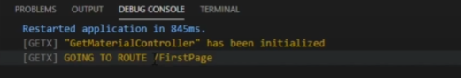
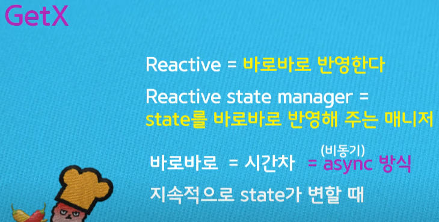
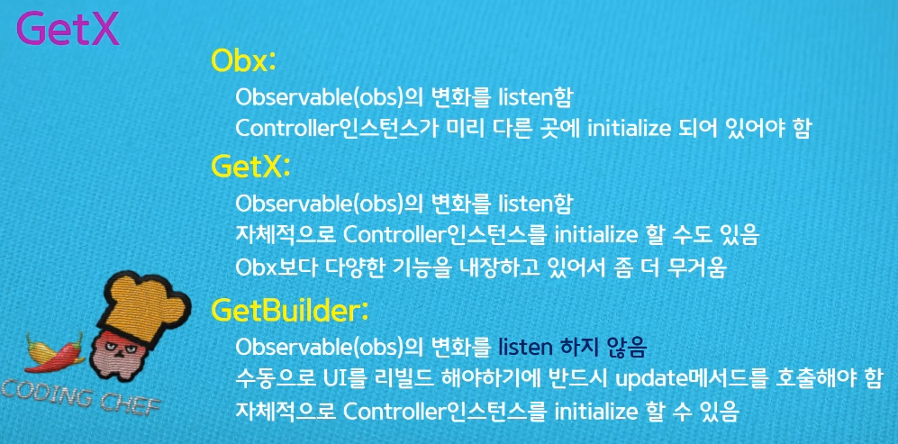
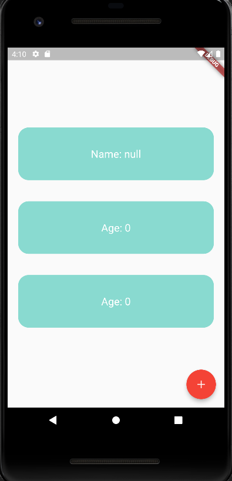
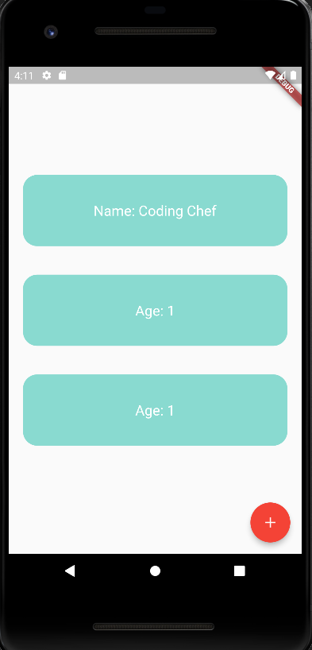
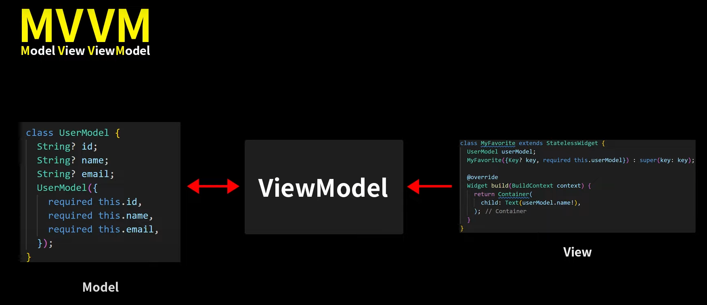

## GetX
# 
Flutter에서 상태관리가 무엇이고 왜 필요하냐?

Flutter에서는 모든것이 Widget이다.

 크게 단순 텍스트나 사진 등 정적인 화면을 구성할때에는 StatelessWidget가 해당되고 사용자가 텍스트를 입력하는 텍스트필드, 라디오박스,실시간으로 데이터가 바뀌어야하는 상황 등 화면에 변화가 있는 동적인 화면을 구성할때에는 StatefulWidget을 사용한다.

상태관리란 컴포넌트를 통해서 class의 state가 관리가 되어지는데 자식 컴포넌트들 간의 데이터의 이동과정에서 불필요한 이동과 UI에서 실시간으로 변하는 여러 데이터들의 상태를 효율적으로 관리하기위함이다.

 상태 관리는 애플리케이션의 데이터와 UI 간의 일관성을 유지하기 위해 필요합니다. 대규모 애플리케이션에서는 데이터의 변화에 따라 UI를 업데이트하고 다양한 컴포넌트 간의 데이터 전달을 관리하는 것이 중요하다.

 기존의 StatefullWidget을 사용하면 특정데이터가 바뀌면 화면 전체를 재렌더링하여 데이터의 변화를 보여주는데 화면안의 데이터들이 모두 변하는것이 아닌 상황도 존재하기
때문에(화면의 일부분만를 변경)화면전체를 재렌더링하는것은 자원의 낭비가 크다.
 그리고 특정 데이터가 바뀔때 다른 화면에서도 해당 데이터의 변화가 동일하게 이루어져야한다. 즉 동기화되어야한다.

 Flutter가 제공하는 StatefulWidget통해서 모든 기능을 구현할수있지만 앱이 커지고 복잡해질수록 setState()로 전체화면을 재렌더링하는것은 너무나 비효율적이다.

 상태관리 기술을 사용하게 되면 실시간으로 변화하는 데이터에 대한 처리와 여러 컴포넌트에서 공통적으로 사용하는 데이터의 동기화를 아주 쉽고 효율적으로 해결할 수 있다.

Flutter에서 GetX는 강력한 상태 관리 라이브러리 중 하나로, Flutter 애플리케이션에서 상태를 관리하고 업데이트하는 데 도움을 준다.
# 
### GetX의 장점
1. 상태 중앙 관리: GetX를 사용하면 애플리케이션의 상태를 중앙에서 관리할 수 있다. 중앙 상태 관리는 데이터의 일관성과 유지보수성을 향상시킨다
   
2. 반응형 업데이트: GetX는 반응형(Reactive) 상태 관리를 지원한다. 상태가 변경되면 해당 상태를 사용하는 위젯은 자동으로 업데이트된다.
   
3. 의존성 주입: GetX는 의존성 주입(Dependency Injection)을 지원하여 애플리케이션의 다양한 부분에서 사용되는 객체를 쉽게 관리할 수 있다. 필요한 객체를 애플리케이션에서 쉽게 찾고 사용할 수 있도록 도와준다.
   
4. 라우팅 및 네비게이션: GetX는 강력한 라우팅 및 네비게이션 기능을 제공한다. GetX를 사용하면 페이지 간 전환과 관련된 작업을 쉽게 처리할 수 있다.
   
5. 효율적인 성능: GetX는 성능을 최적화하기 위해 다양한 기능을 제공한다. GetX는 상태 변화가 발생했을 때 해당 상태를 사용하는 위젯만 업데이트하므로 불필요한 렌더링을 방지하고 성능을 향상시킨다. 필요한 상태만 가져오는 기능을 제공한다.

6. Get은 상태 관리를 위한 간단한 API를 제공한다.  상태를 저장하고 관리하기 위해 GetxController 클래스를 사용한다. GetxController 클래스를 상속받은 컨트롤러를 생성하면, 해당 컨트롤러에서 상태를 관리하고 상태의 변화에 따라 UI를 자동으로 업데이트할 수 있다.
   
7. 다국어 지원: GetX은 다국어 지원을 제공한다. 애플리케이션에서 다국어를 사용해야하는 경우 Get을 사용하여 간단하게 다국어 지원을 구현할 수 있다.
   
# 
실제 사용시 장점
1. 코드의 간결성

페이지를 이동할때 flutter default code는 
```dart
Navigator.of(context).push(
                    MaterialPageRoute(
                      builder: (_) => const FirstPage(),
                    ),
                  );
```
이것처럼 길고 복잡하다. 하지만 GetX를 사용하면 
```dart
Get.to(FirstPage());
```
이처럼 엄청 간결해진다.

2. GetX는 페이지나 상태가 변화하면 그 내용을 log를 통해 전달해준다



# GetX의 주요기능
## 1. 상태관리
## 2. 라우트관리
## 3. 종속성관리
 

  
# 1. 상태관리
 Getx는 데이터를 초기화하고 더 이상 필요하지 않을 때 제거할 수 있는 클래스를 제공하며 사용법은 매우 간단하다. GetxController를 확장하여 클래스를 만들고 거기에 모든 변수와 함수를 삽입하기만 하면 된다. 

```dart
class Controller extends GetxController {
  var count = 0;
  void increment() {
    count++;
    update();
  }
}
```
이 controller는 counter라는 변수와 counter의 값을 1씩 증가해주는 increase() 함수를 가지고 있습니다. increase() .함수 안에 update()는 이 controller을 바라보고있는 모든 코드에 업데이트를 알리는 역할을 한다.

GetX에는 두종류의 state management가있음

 단순 상태 관리와 반응형 상태 관리의 차이는 반응형 상태 관리의 경우 데이터가 변화가 있을 때만 재랜더링을 하게 되는 반면에 단순 상태 관리는 기존의 데이터와 변경되는 데이터가 같은지 확인하지 않는다.

## 1. Simple State management (GetBuilder) : 단순 상태 관리

simple 방식은 reactive 방식보다 메모리를 적게 사용한다.
Simple State management는 update()가 호출될 때마다 화면의 변수를 업데이트합니다. "GetBuilder"라는 위젯과 함께 사용됩니다.
```dart
class Home extends StatelessWidget {
  final controller = Get.put(
      Controller()); // Controller 클래스의 인스턴스를 생성하고 GetX의 의존성 주입을 사용하여 해당 인스턴스를 관리합니다.

  @override
  Widget build(BuildContext context) {
    return Scaffold(
      appBar: AppBar(title: Text("counter")), // 앱 바에 "counter"라는 제목을 표시합니다.
      body: Center(
        child: Column(
          mainAxisAlignment: MainAxisAlignment.center,
          children: [
            GetBuilder<Controller>(
                // GetX의 GetBuilder 위젯을 사용하여 Controller 클래스의 인스턴스에 대한 상태 변경을 관찰합니다.
                builder: (_) => Text(
                      'clicks: ${controller.count}', // 'clicks: '와 컨트롤러의 count 값이 표시되는 텍스트 위젯입니다.
                    )),
            ElevatedButton(
              child: Text('Next Route'), // "Next Route"라는 텍스트를 가진 일반 버튼 위젯입니다.
              onPressed: () {
                Get.to(Second()); // 버튼을 누르면 Second 클래스를 가진 새로운 라우트로 이동합니다.
              },
            ),
          ],
        ),
      ),
      floatingActionButton: FloatingActionButton(
        child: Icon(Icons.add), // "+" 아이콘이 있는 플로팅 액션 버튼 위젯입니다.
        onPressed:
            controller.increment(), // 버튼을 누르면 컨트롤러의 increment 메서드가 실행됩니다.
      ),
    );
  }
}

class Second extends StatelessWidget {
  final Controller ctrl =
      Get.find(); // GetX의 Get.find()를 사용하여 이전에 생성된 Controller 인스턴스를 찾습니다.

  @override
  Widget build(context) {
    return Scaffold(
        body: Center(
            child: Text("${ctrl.count}"))); // "ctrl.count"를 텍스트로 표시하는 위젯입니다.
  }
}

```
먼저 controller를 사용하기 위해 Get.put()으로 controller를 등록한다.GetBuilder()아래의 모든 위젯은 controller에서 변경되는 데이터를 실시간으로 반영할 수 있는 상태가 된다. 
controller.counter는 controller의 변수를 실시간으로 반영하게 되고 controller.increase()는 controller의 counter 데이터를 실시간으로 증가시키게된다. 만약 GetBuilder를 사용하지 않을 경우 Get.find<[Controller종류]>().[변수 혹은 함수] 로 컨트롤러의 데이터를 실시간 변경 혹은 반영할 수 있다.

### 다른 방법으로
```dart
GetBuilder<Controller>(
  init: Controller(),
  builder: (_) => Text(
    'Current value is : ${Get.find<Controller>().x}',
  )
),
TextButton(
  onPressed:(){
    Get.find<Controller>().increment();
  }
)
```
final controller = Get.put(Controller());을 선언하지않고 GetBuilder의 초기값을 선언해주어 사용하는 방법도 있다.


## 2. Reactive State management
# 
(GetX/Obx) : 반응형 상태 관리

단순 상태관리와 비교하면 변수를 선언하는 방식과 업데이트 함수 부분이 다르다. 변수를 선언하는 방식은 변수의 타입을 RxInt, RxString등 Rx{타입}의 방식으로 선언하고 변수의 값은 ‘.obs’를 붙이게 된다. 업데이트의 경우 update() 함수를 부르지 않아도 된다.

```dart
class ReactiveController extends GetxController {
  RxInt counter = 0.obs;

  void increase() {
    counter++;
  }
}
```
reactive 방식에선 update() 함수가 필요하지 않다.

```dart
class MyHomePage extends StatelessWidget {
  MyHomePage({Key? key}) : super(key: key);

  @override
  Widget build(BuildContext context) {
    Get.put(SimpleController()); // 단순 상태 관리 컨트롤러를 등록합니다.
    Get.put(ReactiveController()); // 반응형 상태 관리 컨트롤러를 등록합니다.
    return Scaffold(
      appBar: AppBar(
        title: const Text("단순 / 반응형 상태관리"),
      ),
      body: Center(
        child: Column(
          mainAxisAlignment: MainAxisAlignment.center,
          children: [
            GetBuilder<SimpleController>(
              // GetX의 GetBuilder를 사용하여 단순 상태 관리를 수행합니다.
              builder: (controller) {
                return ElevatedButton(
                  child: Text(
                    '[단순]현재 숫자: ${controller.counter}',
                  ),
                  onPressed: () {
                    controller.increase();
// Get.find<SimpleController>().increase();
                  },
                );
              },
            ),
            GetX<ReactiveController>(
              // GetX의 GetX를 사용하여 반응형 상태 관리를 수행합니다. (방법 1)
              builder: (controller) {
                return ElevatedButton(
                  child: Text(
                    '반응형 1 / 현재 숫자: ${controller.counter.value}', // .value로 접근하여 상태를 가져옵니다.
                  ),
                  onPressed: () {
                    controller.increase();
// Get.find<ReactiveController>().increase();
                  },
                );
              },
            ),
            Obx(
              // GetX의 Obx를 사용하여 반응형 상태 관리를 수행합니다. (방법 2)
              () {
                return ElevatedButton(
                  child: Text(
                    '반응형 2 / 현재 숫자: ${Get.find<ReactiveController>().counter.value}', // .value로 접근하여 상태를 가져옵니다.
                  ),
                  onPressed: () {
                    Get.find<ReactiveController>().increase();
                  },
                );
              },
            ),
          ],
        ),
      ),
    );
  }
}

```
먼저 단순 상태 관리와 동일하게 controller를 사용하기 위해 Get.put()으로 controller를 등록해준다. 반응형 상태 관리에서 데이터를 실시간으로 반영하는 방식에는 두가지가 있다.
1. GetX() (simple 방식의 GetBuilder과 같은 역할을 하는 것이 GetX이다.) 
   - GetX<ReactiveController>를 사용 아래의 모든 위젯은 controller에서 변경되는 데이터를 실시간으로 반영할 수 있는 상태가 된다. controller.counter.value (단순 상태 관리와 다르게
.value 를 추가해 주어야 한다) 는 controller의 변수를 실시간으로 반영하게 되고 버튼을 누를 때마다 ReactiveController의 increase 메서드가 호출되어 counter 값이 증가한다. builder 함수 내부에서는 counter.value로 반응형 상태에 접근하여 UI를 업데이트한다. 만약 GetX를 사용하지 않을 경우 Get.find<[Controller종류]>().[변수 혹은 함수] 로 컨트롤러의 데이터를 실시간 변경 혹은 반영할 수 있다. 
```dart
GetX<Controller>( // init을 통해 Controller를 등록할 수 있지만 여기선 Get.put을 사용
              builder: (_) => Text(
                'clicks: ${_.count2.value}',
	),
),
```
위처럼 필요한 경우 GetBuilder에서처럼 init을 통해 Controller를 등록할 수 있다.


2. Obx()
    - Obx() 아래의 모든 위젯은 GetX()와 마찬가지로 controller에서 변경되는 데이터를 실시간으로 반영할 수 있는 상태가 된다. 사용 방식은 거의 동일하지만 차이가 있다면 GetX()와 달리 controller의 이름을 지정할 수가 없어서 Get.find() 방식으로 접근해야 한다.
# 

## ※마무리하는 간단한 예시
# 
페이지 상태 관리는 Flutter 애플리케이션에서 각 페이지 또는 화면의 상태를 관리하고 동기화하는 것을 의미한다. 이를 위해 주로 상태 관리 패턴과 라이브러리(GetX)를 사용한다.

1. GetX의 상태 클래스 생성: GetX의 Controller 클래스를 상속하는 상태 관리 클래스를 생성한다. 이 클래스는 해당 페이지 또는 컴포넌트의 상태를 저장하고 업데이트하는 역할을 한다.

```dart
class MyPageController extends GetxController {
  RxInt counter = 0.obs; // 예시로 정수형 카운터 상태를 가진 Reactive 클래스

  void increment() {
    counter.value++;
  }
}
```
2. 페이지에서 상태 클래스 사용: 해당 페이지 또는 컴포넌트에서 상태 관리 클래스를 사용한다.
```dart
class MyPage extends StatelessWidget {
  final MyPageController controller = Get.put(MyPageController());

  @override
  Widget build(BuildContext context) {
    return Scaffold(
      appBar: AppBar(
        title: Text('My Page'),
      ),
      body: Center(
        child: Column(
          mainAxisAlignment: MainAxisAlignment.center,
          children: [
            Obx(() => Text('Counter: ${controller.counter.value}')),
            ElevatedButton(
              child: Text('Increment'),
              onPressed: () {
                controller.increment();
              },
            ),
          ],
        ),
      ),
    );
  }
}

```
3. GetX 상태 관리 기능 사용: GetX의 상태 관리 기능을 활용하여 페이지 상태를 관리한다. 위 예제에서는 Obx 위젯을 사용하여 상태 변화를 감지하고 UI를 업데이트한다. 버튼을 누르면 상태 관리 클래스의 메서드를 호출하여 상태를 변경하고 UI가 자동으로 업데이트된다.
위 코드에서는 MyPageController를 MyPage 클래스에 의존성 주입하고, Obx 위젯을 사용하여 counter 값의 변화를 감지하여 UI를 업데이트한다. 버튼을 누르면 increment 메서드가 호출되어 counter 값이 증가하고, Obx 위젯이 해당 변화를 감지하여 UI를 업데이트한다.

이처럼 GetX를 활용하여 페이지 상태를 관리하면 상태 변화를 효율적으로 감지하고 UI를 업데이트할 수 있다. 
# 
# ※중요포인트
BuildContext를 통하지 않는 객체 참조 방식은 예기치 못한 곳에서 문제를 일으킬 가능성이 있습니다. 한 예로 GetX 사용 중 아래와 같이 동일한 클래스의 인스턴스를 두 개 이상 등록할 때 문제가 발생했습니다.
```dart
final tab1 = TabViewModel('tab1');
Get.put(tab1)
 
final tab2 = TabViewModel('tab2'); // 동일한 클래스로 다른 인스턴스를 생성
Get.put(tab2)
 
// tab1을 받을지 tab2를 받을지 알 수 없음
TabViewModel tab = Get.find()

...

// 이 문제는 GetX에서 태그를 지정하는 방식을 사용해야 해결할 수 있음

// 태그 지정해야 함
Get.put(TabViewModel(), tag: 'tab1');
Get.put(TabViewModel(), tag: 'tab2');
 
// 뷰모델 사용, 태그를 알아야 가져올 수 있음
TabViewModel tab1 = Get.find(tag: 'tab1'); 
TabViewModel tab2 = Get.find(tag: 'tab2');
// ← 뷰모델을 사용하는 자식 위젯에게 태그 값을 매번 전달해야 해서 불편, BuildContext를 사용하는 게 낫지 않을까?
```
# 

### 1.Getter 사용

Get.find<[Controller종류]>().[변수 혹은 함수]를 보다 간단하게 사용하기 위해서는 아래와 같이 controller 내부에 getter를 생성해주면 된다.

```dart
class SimpleController extends GetxController {
  static SimpleController get to => Get.find();
  ...
 }
```

```dart
// 전
Get.find<SimpleController>().increase();
// 후
SimpleController.to.increase();
```

### 2.GetView 사용
Get.find()를 사용하는 클래스에 StatelessWidget 대신 GetView를 상속받는 방식

```dart
// 전
class SimpleState extends StatelessWidget{}
// 후
class SimpleState extends GetView<SimpleController>{}

```
Get.find()를 기존보다 더 짧은 코드로 사용할 수 있게 됩니다.

```dart
// 전
Get.find<SimpleController>().increase();
// 후
controller.increase();
```

# 2. 라우트관리
  -다른 페이지로 이동하거나 Dialog를 띄울 때 같이 라우트간 이동에서 Context를 필요로 한다. 하지만 GetX를 사용하면 Context 없이 라우트를 관리할 수 있다. 따라서 코드가 간결해지고 쉬워진다.

  -GetX의 라우트 관리는 페이지 간의 전환과 네비게이션을 쉽게 처리할 수 있도록 도와준다.

  라우트(Route) 관리를 위해서는 GetMaterialApp을 사용해야 한다.

  ```dart
void main() => runApp(MaterialApp(home: Home()));
 

void main() => runApp(GetMaterialApp(home: Home()));
```

Get을 상태관리로만 사용할 것이다 하면 MaterialApp() 앞에 Get을 안붙혀도 되지만 라우트관리, 종속성 관리의 주요기능들을 사용하기위해서는 GetMaterialApp() 으로 MaterialApp()을 Get으로 감싸줘야함

## Navigation - 화면이동

1. Get.to()

- Get.to() 메서드는 현재 페이지에서 새로운 페이지로 이동하는 데 사용됩니다.
이 메서드는 스택에 새로운 페이지를 추가하고, 사용자가 이전 페이지로 돌아갈 수 있도록 합니다.
Get.to()는 다음 화면으로 전환하기 위해 새로운 페이지를 스택에 푸시합니다.
- 지정한 새로운 화면으로 이동한다. 아래의 코드에서는 NextPage()로 이동한다.

   ```dart
   TextButton(
       onPressed: () => Get.to(const NextPage()), //해당 페이지로 이동
       child: const Text('Get.to()'),
   ),
   ```

2. Get.toNamed()
- Get.toNamed() 메서드는 이름으로 라우트를 전환하는 데 사용됩니다.
라우트 이름은 MaterialApp에서 정의한 routes 맵에 등록된 이름입니다.
Get.toNamed()는 라우트 이름을 기반으로 해당 라우트로 이동합니다.

- 먼저 GetPage를 사용해 이름을 설정해준다
  ```dart
  GetPage(name: '/next', page: () => const NextPage(), transition: Transition.zoom),
  ```
  transition: Transition.zoom은 화면이 이동할때의 효과를 추가해주는 기능
  zoom 말고도 여러 다른 모션이 있다.

- 미리 설정해둔 이름을 통해 새로운 화면으로 이동한다. 아래의 코드에서는 /next라는 이름을 가진 페이지로 이동한다.
   ```dart
   TextButton(
	onPressed: () => Get.toNamed('/next'), // 미리 설정해둔 이름을 통해 새로운 화면으로 이동
	`child: const Text('Get.toNamed()'),
   ),
   ```

※Arguments 전달
   ```dart
   TextButton(
	onPressed: () => Get.toNamed('/next', arguments: "이민재"), // 미리 설정해둔 이름을 통해 새로운 화면으로 이동
	`child: const Text('Arguments 전달')
   ),
   ```
Get.toNamed('/next', arguments: "이민재"),로 인해 이동한 페이지의 코드
   ```dart
   Text("${Get.arguments}")
   ```
   이렇게 하기만하면 그전페이지에서 전달한 arguments의 값을 받아 출력할수있다 


- 아래는 int형을 arguments를 보낼때이다
   ```dart
   TextButton(
	onPressed: () => Get.toNamed('/next', arguments: 3), // 미리 설정해둔 이름을 통해 새로운 화면으로 이동
	`child: const Text('Arguments 전달')
   ),
   ```
  이동한 페이지의 내부코드
   ```dart
   Text("${Get.arguments.toString()}")
   ```

- 아래는 map타입으로 arguments를 보낼때이다
   ```dart
   TextButton(
	onPressed: () => Get.toNamed('/next', arguments: {"name": "이민재", "age": "22"}), // 미리 설정해둔 이름을 통해 새로운 화면으로 이동
	`child: const Text('Arguments 전달')
   ),
   ```
  이동한 페이지의 내부코드
   ```dart
   Text("${Get.arguments['name']} : ${Get.arguments['age']}")
   ```

- 커스텀한 클래스객체도 보낼수있다

   ```dart
   class User{
  String name;
  int age;
  User({this.name, this.age})
  }
   ```
   ```dart
   TextButton(
	onPressed: () => Get.toNamed('/next', arguments: User(name: "이민재", age: 24)), // 미리 설정해둔 이름을 통해 새로운 화면으로 이동
	`child: const Text('Arguments 전달')
   ),
   ```
  이동한 페이지의 내부코드
   ```dart
   Text("${(Get.arguments as User).name} : ${(Get.arguments as User).age}")
   ```

※URL 파라미터도 전달할수있다
  ```dart
  GetPage(name: '/next/:uid', 
  page: () => const NextPage(), transition: Transition.zoom
  ),
  ```

1번예시
   ```dart
   TextButton(
	onPressed: () => Get.toNamed('/next/28357'), // 동적 url
	`child: const Text('동적 url')
   ),
   ```
  이동한 페이지의 내부코드
   ```dart
   Text("${(Get.parameters['uid']}")
   ```  


2번예시
   ```dart
   TextButton(
	onPressed: () => Get.toNamed('/next/28357?name=이민재&age=24'), // 동적 url
	`child: const Text('동적 url')
   ),
   ```
  이동한 페이지의 내부코드
   ```dart
   Text("${(Get.parameters['uid']}")
   Text("${(Get.parameters['name']}")
   Text("${(Get.parameters['age']}")
   ```

1. Get.back()
- 이전 화면으로 돌아간다.
   ```dart
   TextButton(
	onPressed: () => Get.back(), //이전 화면으로 돌아감.
	child: const Text('Get.back()'),
   ),
  ```  

1. Get.off()
- Get.off() 메서드는 현재 페이지를 스택에서 제거하고, 새로운 페이지로 이동하는 데 사용됩니다.
현재 페이지를 스택에서 제거하기 때문에 사용자가 이전 페이지로 돌아갈 수 없습니다.
Get.off()는 현재 페이지를 스택에서 제거한 후 다음 페이지로 이동합니다.

- 다음 화면으로 이동하면서 이전 화면을 아에 없애버린다. 이전 화면으로 돌아갈 필요가 없을 때 사용한다.
   ```dart
   TextButton(
	onPressed: () => Get.off(const NextPage()), // 다음 화면으로 이동하면서 이전 화면을 없애 버린다.
	child: const Text('Get.off()'),
   ),
   ```

5. Get.offAll()
- Get.offAll() 메서드는 현재 페이지와 스택에 남아 있는 모든 페이지를 제거하고, 새로운 페이지로 이동하는 데 사용됩니다.
이 메서드는 스택을 완전히 초기화하고 새로운 페이지를 추가합니다.
Get.offAll()은 이전의 모든 페이지를 스택에서 제거한 후 다음 페이지로 이동합니다.

- Get.off()가 이전 화면 하나만 없앴다면 Get.offAll()는 이전의 모든 화면을 없애고 다음 화면으로 이동한다.
   ```dart
   TextButton(
	onPressed: () => Get.offAll(const NextPage()), //off는 전 화면 하나만 없애지만 offAll은 화면 전체를 없앤다.
	child: const Text('Get.offAll()'),
   ),
   ```

## 스낵바(Snackbar)
- 기본적으로 Snackbar는 하단에서만 나온다. GetX를 사용하면 Snackbar를 상단에도 띄울 수 있다.


1. Get.snackbar()
- 제목과 메시지를 설정하면 해당 내용으로 Snackbar를 보여준다. 지속시간(duration), 스낵바 위치(snackPosition), 배경색(backgroundColor) 등 여러 설정을 추가할 수 있다.
  ```dart
   TextButton(
	onPressed: () =>
	Get.snackbar( //Snackbar 생성
		'Snackbar', // Snackbar title,
		'Snackbar', // SnackbarDescription,
		snackPosition: SnackPosition.TOP),  // Snackbar 위치
		child: const Text('Get.snackbar()'),
   ),
  ```

2. Get.showSnackbar()
- Get.snackbar() 와 거의 동일하다. Get.showSnackbar()는 안에 GetBar()를 사용한다.
  ```dart
   TextButton(
	onPressed: () =>
	Get.showSnackbar(
		GetBar(
			title: 'Snackbar', // Snackbar title
            message: 'Snackbar', //Snackbar Description
			duration: const Duration(seconds: 2), // Snackbar 지속시간
			snackPosition: SnackPosition.BOTTOM, // Snackbar 위치
              ),
           ),
	child: const Text('Get.showSnackbar()'),
   ),
  ```


## Dialog

- Get.defaultDialog()
Dialog를 화면에 띄어준다. 확인/취소 시에 실행할 함수(onConfirm, onCancel), 확인/취소 텍스트(textConfirm, textCancel), 배경색(backgroundColor) 등 여러 설정들을 추가할 수 있다.

   ```dart
   TextButton(
	onPressed: () => Get.defaultDialog( // 기본 대화창 생성
		title: 'Dialog', // 대화창 title
		middleText: 'Dialog' // 대화창 Description
   		),
	child: const Text('Get.defaultDialog()'),
   ),
   ```

# 3. 종속성관리(의존성 관리)

아래의 코드를보면 기존의 페이지이동후 의존성을 초기화하는것이 아닌 라우트 단계에서 의존성을 초기화를 할수있다. 즉 페이지를 들어감과 동시에 인스턴스를 생성하고 메모리에 올려준다. 그리고 페이지가 없어질때 인스턴스한 컨트롤러를 클로즈하고 메모리로부터 삭제해준다.
이를 사용하지않으면 인스턴스가 메모리에 계속적으로 쌓이게 되는 경우가 생겨 성능이 안좋아져 메모리관리를 잘해야하는데 이를 사용하면 더이상 사용하지않을때(페이지를 닫을때) 알아서 삭제해주기때문에 용이하다.

   ```dart
  TextButton(
  child: const Text('Getput'),
	onPressed: () {
     Get.to(const GetPutPage(),
      binding: BindingsBuilder((){
        Get.put(DependecyController());
        }),
      ); 
    }	
   ),
   ```
아래콘솔창은 GETX에서 상태관리로그를 적어준것이다.
컨트롤러를 초기화하고 페이지가 닫히면 클로즈해준다


Get.put은 페이지에 들어감과 동시에 메모리에 올리는 방면에 다른방법은 Get.LazyPut이다. 이는 바로 인스턴스해주는 Get.put과 달리 버튼을 누르는 액션을 취했을때(버튼을 눌렀을때) 그제서야 메모리에 올리고 인스턴스해주는것이다. 
즉 DependecyController 인스턴스가 접근을 하려고할때 그제서야 초기화한다는 소리이다. 그리고 똑같이 페이지에서 나올때 알아서 메모리를 삭제시켜준다.


Get.lazyPut 메서드는 필요한 시점에 의존성을 해결하고 인스턴스를 등록하는 데 사용됩니다. 즉, 해당 클래스 또는 객체가 실제로 필요한 경우에만 인스턴스를 생성하고 등록합니다. 이를 지연 로딩(lazy loading)이라고도 합니다.

Get.lazyPut 메서드는 인스턴스를 처음으로 요청할 때까지 인스턴스 생성을 지연시키므로 애플리케이션의 초기 로딩 속도를 향상시킬 수 있습니다.

   ```dart
  TextButton(
  child: const Text('Get.lazyPut'),
	onPressed: () {
     Get.to(const GetLazyPutPage(),
      binding: BindingsBuilder((){
        Get.lazyPut<DependecyController>() => DependecyController();
        }),
      ); 
    }	
   ),
   ```


Get.putAsync는 비동기적으로 의존성을 해결하고 인스턴스를 등록하는 데 사용됩니다. 즉, 인스턴스 생성이 비동기 작업으로 처리되는 경우에 유용합니다.

Get.putAsync 메서드는 Future를 반환합니다. 이 Future는 비동기 작업이 완료되면 해당 인스턴스가 GetX의 의존성 관리 컨테이너에 등록됩니다. 이를 통해 인스턴스가 필요한 곳에서 사용할 수 있게 됩니다.

일반적으로 Get.putAsync는 비동기적으로 데이터를 가져와서 의존성을 해결하고, 해당 데이터를 사용하는 클래스나 객체를 초기화하는 데 사용됩니다. 예를 들어, 데이터베이스에서 사용자 정보를 가져와서 UserController 클래스를 초기화하는 경우에 유용합니다.
   ```dart
  TextButton(
  child: const Text('Get.putAsync'),
	onPressed: () {
     Get.to(const GetPutAsyncPage(),
      binding: BindingsBuilder((){
        Get.putAsync<DependecyController>(() async {
          await Future.delayed(Duration(seconds: 5));
          return DependecyController();
        });
        }),
      ); 
    }	
   ), 
   ```


아래의 예시에서 fetchDataFromDatabase 함수는 데이터베이스에서 사용자 정보를 비동기적으로 가져오는 함수입니다. 그리고 이 함수의 반환값을 사용하여 UserController 클래스의 인스턴스를 생성합니다. 최종적으로 userController 변수에 해당 인스턴스가 할당됩니다.

이와 같이 Get.putAsync를 사용하면 비동기 작업을 통해 의존성을 해결하고 인스턴스를 등록할 수 있습니다. GetX는 이러한 방식으로 비동기 처리를 지원하여 애플리케이션의 초기화나 데이터 로딩 등의 시나리오에서 유연하고 효과적인 의존성 관리를 제공합니다.


```dart
UserController userController = await Get.putAsync<UserController>(() async {
  // 비동기 작업을 통해 데이터 가져오기
  User user = await fetchDataFromDatabase();

  // 가져온 데이터로 UserController 인스턴스 생성
  UserController controller = UserController(user);

  return controller;
});

```


아래는 page 초기화단계에서도 할수있다는 예시이다
```dart
import 'dart:ui';
import 'package:flutter/material.dart';
import 'package:get/get.dart';

void main() {
  runApp(GetMaterialApp(
    // It is not mandatory to use named routes, but dynamic urls are interesting.
    initialRoute: '/home',
    defaultTransition: Transition.native,
    translations: MyTranslations(),
    locale: Locale('pt', 'BR'),
    getPages: [
      //Simple GetPage
      GetPage(name: '/home', page: () => First()),
      // GetPage with custom transitions and bindings
      GetPage(
        name: '/second',
        page: () => Second(),
        customTransition: SizeTransitions(),
        binding: SampleBind(),
      ),
      // GetPage with default transitions
      GetPage(
        name: '/third',
        transition: Transition.cupertino,
        page: () => Third(),
      ),
    ],
  ));
}
```

Bindings클래스를 상속받아 사용할수있다
```dart
class SampleBind extends Bindings {
  @override
  void dependencies() {
    Get.lazyPut<ControllerX>(() => ControllerX());
  }
}
```

# MVC pattern

MVC(Mode-View-Controller)는 소프트웨어 개발에서 사용되는 소프트웨어 디자인 패턴 중 하나입니다. MVC 패턴은 애플리케이션을 세 가지 주요 컴포넌트로 나누어 개발하며, 이러한 컴포넌트 간의 역할과 상호작용을 명확하게 정의하여 코드의 유지보수성과 재사용성을 향상시킵니다.

Model (모델):

애플리케이션의 데이터, 상태, 비즈니스 로직을 담당합니다.
데이터를 저장하고 조작하는데 필요한 메서드와 속성을 가지고 있습니다.
모델은 일반적으로 데이터베이스, API, 파일 시스템 등과 상호작용하여 데이터를 가져오고 업데이트합니다.
데이터 변경 사항을 알리기 위해 옵저버 패턴 등을 사용할 수 있습니다.

View (뷰):

사용자에게 데이터를 표시하고 사용자의 입력을 받는 역할을 합니다.
일반적으로 UI 요소들을 구성하고 사용자와 상호작용하기 위한 이벤트 핸들러를 가지고 있습니다.
뷰는 모델의 데이터를 표시하기 위해 모델과 연결되어야 합니다.
MVC에서 뷰는 모델의 상태 변화를 감지하고 반영하기 위해 옵저버 패턴 등을 사용할 수 있습니다.

Controller (컨트롤러):

모델과 뷰 사이의 중재자 역할을 합니다.
사용자의 입력을 받아 모델의 상태를 업데이트하고, 그에 따라 뷰를 갱신합니다.
컨트롤러는 사용자의 액션을 감지하고 그에 대한 적절한 동작을 수행합니다.
일반적으로 컨트롤러는 뷰와 모델 간의 의존성을 제어하고, 이벤트 핸들링, 데이터 변환 등을 처리합니다.

MVC 패턴은 각 컴포넌트 간의 역할을 명확히 나누어 개발을 진행하므로 코드의 구조화와 유지보수가 용이해집니다. 모델, 뷰, 컨트롤러는 서로 독립적으로 개발될 수 있으며, 이로 인해 개발 작업을 병렬화하고 재사용 가능한 컴포넌트를 만들 수 있습니다.


# 

간단한 mvc 모델의 코드를 해석해보자

main.dart
```dart
import 'package:flutter/material.dart';
import 'package:get/get.dart';
import 'package:lecuture2/personal_card.dart';

void main() {
  runApp(const MyApp());
}

class MyApp extends StatelessWidget {
  const MyApp({Key? key}) : super(key: key);

  @override
  Widget build(BuildContext context) {
    return GetMaterialApp(
      home: PersonalCard(),
    );
  }
}
```


model.dart(Model)
```dart
class Person{
  //Person({this.age = 0, this.name = ''});
  int age = 0;
  String? name;
}
```
personal_card.dart(View)
```dart
import 'package:flutter/material.dart';
import 'package:get/get.dart';
import 'package:lecuture2/controller.dart';

class PersonalCard extends StatelessWidget {
  PersonalCard({Key? key}) : super(key: key);
  final Controller controller = Get.put(Controller());

  @override
  Widget build(BuildContext context) {
    return Scaffold(
      body: Center(
        child: Column(
          mainAxisAlignment: MainAxisAlignment.center,
          crossAxisAlignment: CrossAxisAlignment.center,
          children: [
            Container(
              margin: EdgeInsets.all(20),
              width: double.maxFinite,
              height: 100,
              decoration: BoxDecoration(
                  borderRadius: BorderRadius.circular(20),
                  color: Color(0xFF89dad0)),
              child: Center(
                  child: GetX<Controller>(
                builder: (_) => Text(
                  'Name: ${controller.person().name}',
                  style: TextStyle(fontSize: 20, color: Colors.white),
                ),
              )),
            ),
            Container(
              margin: EdgeInsets.all(20),
              width: double.maxFinite,
              height: 100,
              decoration: BoxDecoration(
                  borderRadius: BorderRadius.circular(20),
                  color: Color(0xFF89dad0)),
              child: Center(
                child: Obx(
                  () => Text(
                    'Age: ${controller.person().age}',
                    style: TextStyle(fontSize: 20, color: Colors.white),
                  ),
                ),
              ),
            ),
            Container(
              margin: EdgeInsets.all(20),
              width: double.maxFinite,
              height: 100,
              decoration: BoxDecoration(
                  borderRadius: BorderRadius.circular(20),
                  color: Color(0xFF89dad0)),
              child: Center(
                child: GetX(
                  init: Controller(),
                  builder: (controller) => Text(
                    'Age: ${Get.find<Controller>().person().age}',
                    style: TextStyle(fontSize: 20, color: Colors.white),
                  ),
                ),
              ),
            ),
          ],
        ),
      ),
      floatingActionButton: FloatingActionButton(
        onPressed: () {
          controller.updateInfo();
        },
        child: Icon(Icons.add),
        backgroundColor: Colors.red,
      ),
    );
  }
}
```

controller.dart(Controller)
```dart
import 'package:get/get.dart';
import 'package:lecuture2/model.dart';

class Controller extends GetxController{
  final person = Person().obs;

  void updateInfo(){
    person.update((val) {//여기서 update는 단순 상태관리의 update와 다른 반응형 상태관리의 추가적인 메소드이다.
      val?.age++;
      val?.name = 'Coding Chef';
    });
  }
}
```
초기화면




플로팅버튼을 누룬후




# MVVM pattern

MVVM(Model-View-ViewModel)은 소프트웨어 개발에서 사용되는 소프트웨어 아키텍처 패턴입니다. MVVM은 UI 로직과 비즈니스 로직을 분리하여 애플리케이션의 유지보수성과 테스트 용이성을 향상시킵니다. 다음은 MVVM 패턴의 주요 구성 요소와 역할에 대한 설명입니다:

Model (모델):

데이터와 비즈니스 로직을 담당합니다.
애플리케이션의 상태, 데이터 유효성 검사, 데이터 액세스 등을 처리합니다.
데이터의 변화를 알리기 위해 옵저버 패턴 등을 사용할 수 있습니다.

View (뷰):

사용자 인터페이스(UI)를 표시하고 사용자의 입력을 받습니다.
MVVM에서 뷰는 UI 요소들의 집합으로 구성됩니다.
뷰는 데이터 바인딩을 통해 ViewModel과의 상호작용을 담당하며, ViewModel의 상태 변화에 따라 UI를 갱신합니다.

ViewModel (뷰모델):

뷰와 모델 사이에서 중재자 역할을 합니다.
뷰에 대한 비즈니스 로직을 제공하고, 뷰에 표시되는 데이터를 제공합니다.
뷰와의 양방향 데이터 바인딩을 통해 데이터의 변경을 알립니다.
사용자 입력에 대한 처리와 비즈니스 로직의 실행을 담당합니다.
모델로부터 데이터를 가져와 뷰에 표시하기 위해 데이터 변환 등의 작업을 수행합니다.
MVVM 패턴은 데이터 바인딩을 통해 뷰와 뷰모델을 연결하고, 뷰와 뷰모델 간의 의존성을 최소화하여 유연하고 테스트 가능한 코드를 작성할 수 있습니다. 뷰모델은 뷰의 상태를 추상화하고 뷰의 로직을 분리함으로써 UI와 비즈니스 로직 간의 강한 결합을 피하며, 재사용 가능한 컴포넌트를 만들 수 있습니다.


# 

GetX로 MVVM을 표현한 예제코드

main.dart
```dart
import 'package:dev_pattern_sample/src/pattern_home.dart';
import 'package:flutter/material.dart';
import 'package:get/get.dart';

void main() {
  runApp(const MyApp());
}

class MyApp extends StatelessWidget {
  const MyApp({Key? key}) : super(key: key);

  // This widget is the root of your application.
  @override
  Widget build(BuildContext context) {
    return GetMaterialApp(
      title: 'Flutter Demo',
      theme: ThemeData(
        // This is
        primarySwatch: Colors.blue,
      ),
      home: const PatternHome(),
    );
  }
}
```
pattern_home.dart
```dart
import 'package:flutter/material.dart';
import 'package:get/get.dart';
import 'mvvm_getx/mvvm_getx_controller.dart';
import 'mvvm_getx/mvvm_getx_view.dart';

class PatternHome extends StatelessWidget {
  const PatternHome({Key? key}) : super(key: key);

  @override
  Widget build(BuildContext context) {
    return Scaffold(
      appBar: AppBar(title: const Text('패턴')),
      body: Center(
        child: Column(
          mainAxisAlignment: MainAxisAlignment.center,
          children: [
            ElevatedButton(
                onPressed: () {
                  Get.to(const MVVMGetxView(), binding: BindingsBuilder(
                    () {
                      Get.put(MVVMGetxController());
                    },
                  ));
                },
                child: const Text('MVVM GETX PATTERN')),
          ],
        ),
      ),
    );
  }
}
```
model.dart
```dart
class Model {
  int _count = 0;

  int get counter => _count;
  int incrementCounter() => ++_count;
  int decrementCounter() => --_count;
}
```

view.dart
```dart
import 'package:dev_pattern_sample/src/mvvm_getx/mvvm_getx_controller.dart';
import 'package:flutter/material.dart';
import 'package:get/get_state_manager/get_state_manager.dart';

class MVVMGetxView extends GetView<MVVMGetxController> {
  const MVVMGetxView({Key? key}) : super(key: key);

  @override
  Widget build(BuildContext context) {
    return Scaffold(
      appBar: AppBar(title: const Text('MVC 패턴')),
      body: Center(
        child: Column(
          mainAxisAlignment: MainAxisAlignment.center,
          children: [
            Obx(
              () => Text(controller.count.toString(),
                  style: TextStyle(fontSize: 150)),
            ),
            Row(
              mainAxisAlignment: MainAxisAlignment.center,
              children: [
                Padding(
                  padding: const EdgeInsets.all(8.0),
                  child: ElevatedButton(
                      onPressed: () {
                        controller.incrementCounter();
                      },
                      child: const Text('+')),
                ),
                Padding(
                  padding: const EdgeInsets.all(8.0),
                  child: ElevatedButton(
                      onPressed: () {
                        controller.decreamentCounter();
                      },
                      child: const Text('-')),
                ),
              ],
            )
          ],
        ),
      ),
    );
  }
}
```

controller.dart
```dart
import 'package:dev_pattern_sample/src/model/model.dart';
import 'package:get/get.dart';

class MVVMGetxController extends GetxController {
  late Model model;
  RxInt count = 0.obs;

  @override
  void onInit() {
    super.onInit();
    model = Model();
  }

  void incrementCounter() {
    model.incrementCounter();
    count(model.counter);
  }

  void decreamentCounter() {
    model.decrementCounter();
    count(model.counter);
  }
}

```
# 

